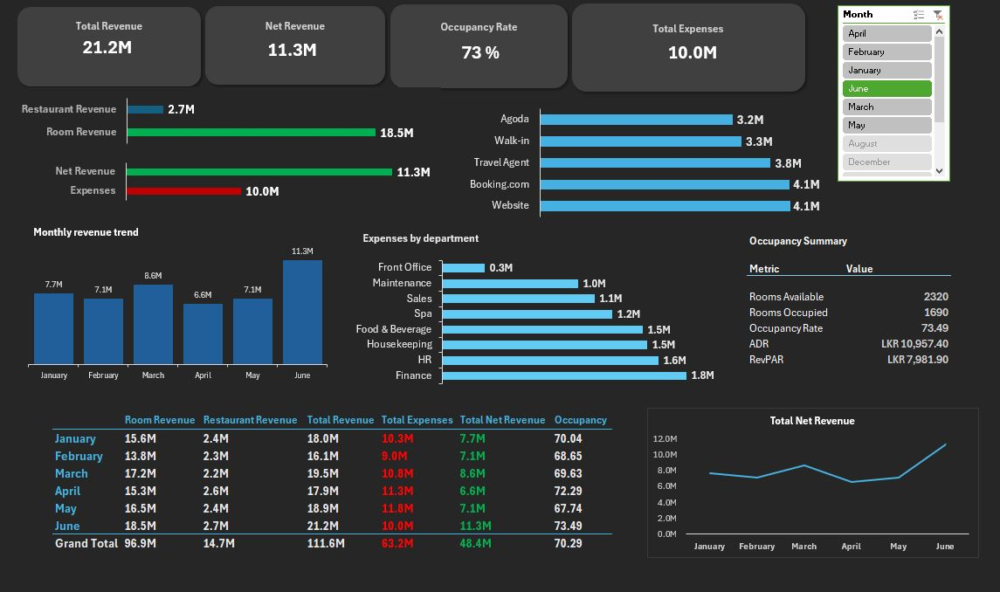
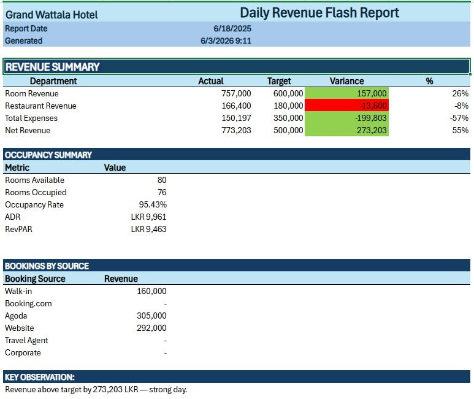
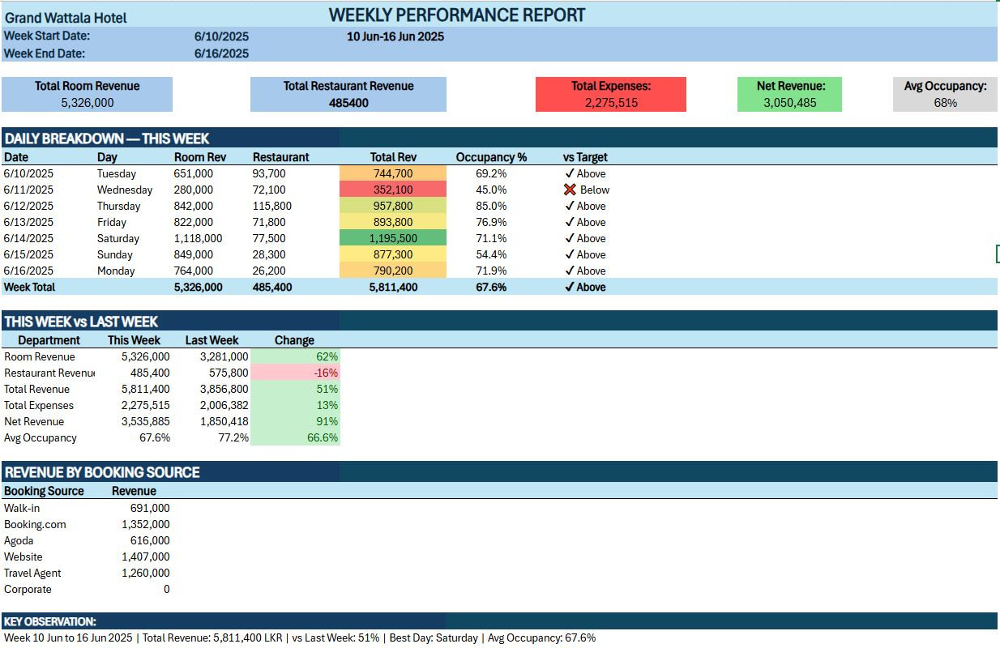
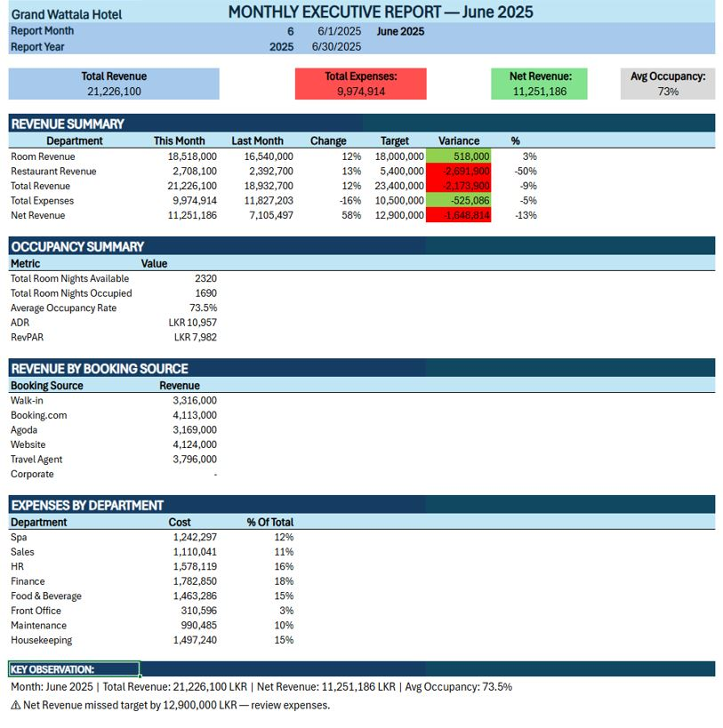
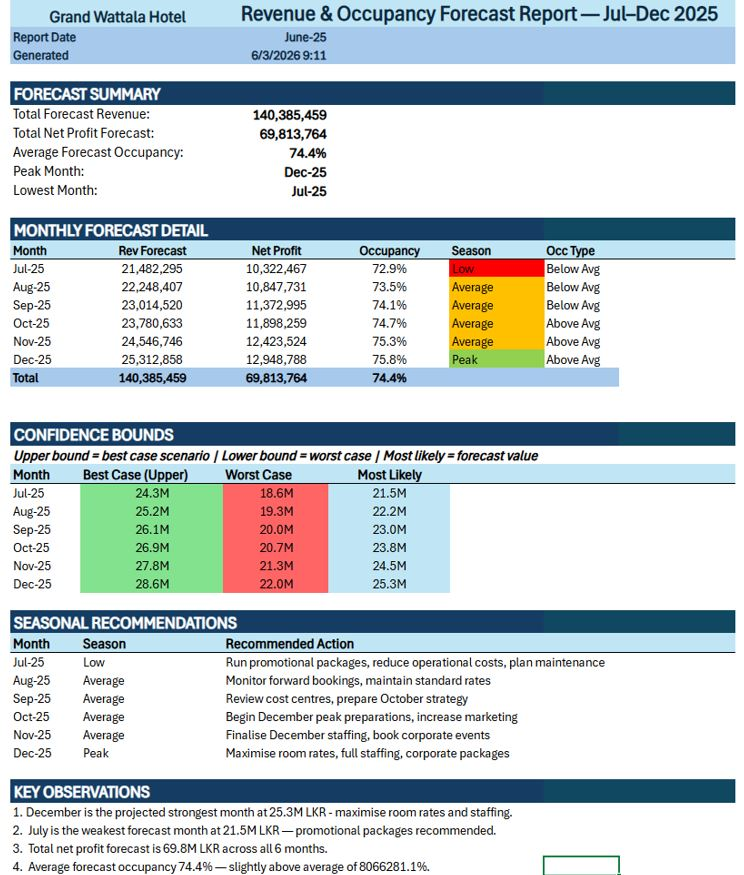

# 🏨 Hotel Revenue Analytics & Reporting Suite

> End-to-end hotel revenue analytics solution built in Microsoft Excel featuring interactive dashboards, operational reporting, and revenue forecasting.

---

## 📊 Project Overview

This project simulates a hotel business intelligence environment where management teams monitor operational performance, profitability, occupancy trends, and future revenue expectations.

The solution includes:

- Executive Revenue Dashboard
- Daily Revenue Flash Report
- Weekly Performance Report
- Monthly Executive Report
- Revenue & Occupancy Forecast Report

All reports are built using Microsoft Excel, Power Query, PivotTables, and the Excel Data Model.

---

## 📁 Project Components

### 1. Executive Revenue Dashboard

Interactive dashboard designed for hotel management to monitor key performance indicators.

#### KPIs

- Total Revenue
- Total Expenses
- Net Revenue
- Occupancy Rate
- ADR (Average Daily Rate)
- RevPAR (Revenue per Available Room)

#### Dashboard Features

- Revenue Trend Analysis
- Revenue by Booking Source
- Revenue by Department
- Expense Analysis
- Occupancy Summary
- Monthly Performance Comparison
- Interactive Month Slicer

---

### 2. Daily Revenue Flash Report

Provides a quick snapshot of daily hotel performance.

#### Includes

- Room Revenue
- Restaurant Revenue
- Total Expenses
- Net Revenue
- Occupancy Rate
- ADR
- RevPAR
- Booking Source Performance
- Target vs Actual Comparison

#### Example Insight

Revenue exceeded target by 273K LKR while occupancy reached 95%.

---

### 3. Weekly Performance Report

Tracks weekly hotel operations and compares performance against the previous week.

#### Includes

- Daily Revenue Breakdown
- Occupancy Trends
- Revenue vs Target
- Week-over-Week Growth
- Booking Source Analysis
- Best Performing Day Identification

#### Example Insight

Revenue increased by 51% compared to the previous week while net revenue improved by 91%.

---

### 4. Monthly Executive Report

Designed for senior management and hotel executives.

#### Includes

- Revenue Summary
- Expense Summary
- Net Revenue Analysis
- Occupancy Metrics
- ADR & RevPAR
- Revenue by Booking Source
- Expenses by Department
- Target vs Actual Analysis

#### Example Insight

June generated LKR 21.2M in revenue with occupancy exceeding 73%.

---

### 5. Revenue & Occupancy Forecast Report

Forecasts hotel performance for the next six months.

#### Includes

- Revenue Forecast
- Net Profit Forecast
- Occupancy Forecast
- Seasonal Classification
- Confidence Bounds
- Best Case Scenario
- Worst Case Scenario
- Strategic Recommendations

#### Example Insight

December is projected to be the strongest month with forecast revenue exceeding LKR 25M.

---

## 📐 Data Model

DateTable (Date)

├── Reservations (CheckInDate)

├── RestaurantSales (SaleDate)

├── Occupancy (Date)

└── Expenses (ExpenseDate)

Reservations

├── Customers (CustomerID)

└── Rooms (RoomID)

---

## 🛠 Tools & Technologies

| Tool                   | Purpose                             |
| ---------------------- | ----------------------------------- |
| Microsoft Excel        | Dashboard & Reporting               |
| Power Query            | Data Cleaning & Transformation      |
| PivotTables            | Aggregation & Analysis              |
| Data Model             | Relationship Management             |
| Slicers                | Interactive Filtering               |
| Conditional Formatting | Variance & Performance Highlighting |
| Forecasting Functions  | Revenue & Occupancy Forecasting     |

---

## 📊 Key Hotel KPIs

| KPI            | Formula                          |
| -------------- | -------------------------------- |
| Occupancy Rate | Rooms Occupied ÷ Rooms Available |
| ADR            | Room Revenue ÷ Rooms Occupied    |
| RevPAR         | Room Revenue ÷ Rooms Available   |
| Net Revenue    | Total Revenue − Total Expenses   |
| Variance %     | (Actual − Target) ÷ Target       |

---

## 📋 Dataset Summary

| Table            | Description                           |
| ---------------- | ------------------------------------- |
| Reservations     | Hotel bookings and room revenue       |
| Restaurant Sales | Food & beverage transactions          |
| Occupancy        | Daily room availability and occupancy |
| Expenses         | Departmental operating expenses       |
| Customers        | Customer information                  |
| Rooms            | Room inventory                        |
| Employees        | Employee information                  |

> All data used in this project is synthetic/sample data created for learning and portfolio purposes.

---

## 📈 Reports Included

| Report                    | Frequency   |
| ------------------------- | ----------- |
| Revenue Dashboard         | Interactive |
| Daily Flash Report        | Daily       |
| Weekly Performance Report | Weekly      |
| Monthly Executive Report  | Monthly     |
| Revenue Forecast Report   | Monthly     |

---

## 💡 Business Insights

- June recorded the highest revenue performance.
- Website and Booking.com are among the strongest revenue channels.
- Housekeeping, HR, and Finance contribute significantly to operational costs.
- Revenue shows a positive growth trend over the six-month period.
- Forecast indicates stronger performance during the year-end peak season.
- Occupancy is expected to remain above 70% throughout the forecast period.

---

## 👩‍💻 Author

**Yogeswaran Yogakrishanthi**

- LinkedIn: https://www.linkedin.com/in/yogeswaran-yogakrishanthi/
- GitHub: https://github.com/yogadharsha98

---

This project demonstrates hotel business intelligence reporting, financial analysis, forecasting, dashboard design, Power Query data transformation, Excel data modelling, and management reporting.
