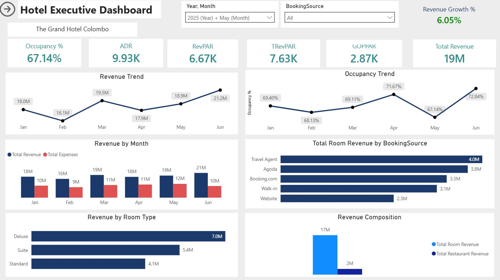
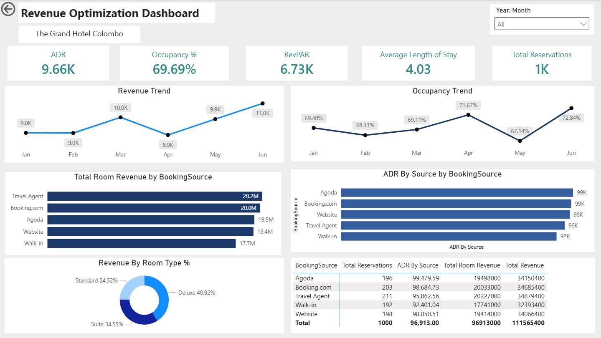
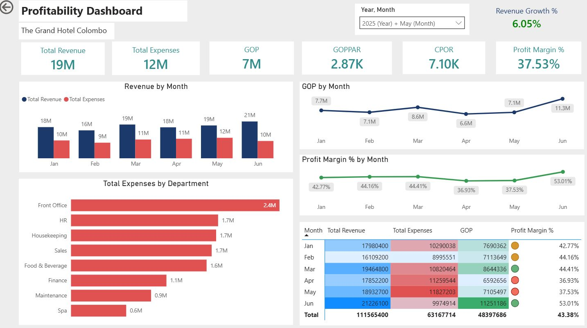

# 🏨 Hotel Business Intelligence & Revenue Analytics Solution (Power BI)

> End-to-end Power BI solution designed for hotel management, revenue optimization, and profitability analysis using hospitality KPIs, financial metrics, and interactive business intelligence dashboards.



---

# 📊 Project Overview

This project simulates a complete Business Intelligence solution for a hotel operation.

The solution transforms raw hotel operational data into actionable insights through three role-based dashboards designed for different business stakeholders:

- Hotel Executive Dashboard (General Manager)
- Revenue Optimization Dashboard (Revenue Manager)
- Profitability Dashboard (Finance Manager)

The project covers revenue analysis, occupancy management, channel performance, profitability tracking, and executive reporting.

---

# 🎯 Business Objectives

This solution helps management answer critical business questions:

- How is overall hotel performance trending?
- Are occupancy and room rates improving?
- Which booking channels generate the highest revenue?
- What is the hotel's profitability?
- Which departments drive operating costs?
- How efficiently are rooms generating revenue?
- What trends require management attention?

---

# 📂 Dashboards Included

## 1️⃣ Hotel Executive Dashboard

### Audience

General Manager (GM)

### Purpose

Provides a high-level view of hotel performance and operational health.

### KPIs

- Occupancy %
- ADR (Average Daily Rate)
- RevPAR (Revenue per Available Room)
- TRevPAR (Total Revenue per Available Room)
- GOPPAR (Gross Operating Profit per Available Room)
- Revenue Growth %

### Visuals

- Revenue Trend
- Occupancy Trend
- Revenue Composition
- Revenue by Booking Source
- Revenue by Room Type
- Monthly Performance Comparison

### Business Questions Answered

- Is hotel revenue increasing?
- Is occupancy improving?
- Which room types generate the highest revenue?
- Which booking channels perform best?
- How efficiently are available rooms generating revenue?

---

## 2️⃣ Revenue Optimization Dashboard



### Audience

Revenue Manager

### Purpose

Supports pricing, channel management, and revenue optimization decisions.

### KPIs

- ADR
- Occupancy %
- RevPAR
- Average Length of Stay
- Total Reservations

### Visuals

- ADR Trend
- Channel Mix Analysis
- Revenue by Booking Source
- ADR by Booking Source
- Channel Performance Matrix
- Occupancy Analysis

### Business Questions Answered

- Which channels drive the most bookings?
- Which channels generate the highest ADR?
- What is the revenue contribution of each source?
- How does occupancy impact revenue performance?
- Which channels should receive greater focus?

---

## 3️⃣ Profitability Dashboard



### Audience

Finance Manager / General Manager

### Purpose

Monitors financial performance and operating profitability.

### KPIs

- Total Revenue
- Total Expenses
- GOP (Gross Operating Profit)
- GOPPAR
- CPOR (Cost Per Occupied Room)
- Profit Margin %

### Visuals

- Revenue vs Expenses Trend
- GOP Trend
- Profit Margin Trend
- Expenses by Department
- Monthly Profitability Matrix

### Business Questions Answered

- Is revenue growing faster than expenses?
- Are operating costs under control?
- Which departments incur the highest expenses?
- Is profitability improving over time?
- Which months generated the strongest financial performance?

---

# 🏨 Hotel KPIs Used

| KPI             | Formula                                |
| --------------- | -------------------------------------- |
| Occupancy %     | Rooms Occupied ÷ Rooms Available × 100 |
| ADR             | Room Revenue ÷ Rooms Occupied          |
| RevPAR          | Room Revenue ÷ Rooms Available         |
| TRevPAR         | Total Revenue ÷ Rooms Available        |
| GOP             | Total Revenue − Total Expenses         |
| GOPPAR          | GOP ÷ Rooms Available                  |
| CPOR            | Total Expenses ÷ Rooms Occupied        |
| Profit Margin % | GOP ÷ Total Revenue × 100              |

---

# 🛠 Tools & Technologies

| Tool                   | Purpose                         |
| ---------------------- | ------------------------------- |
| Power BI Desktop       | Dashboard Development           |
| Power Query            | Data Cleaning & Transformation  |
| DAX                    | KPI & Measure Creation          |
| Data Modeling          | Star Schema Relationships       |
| Interactive Visuals    | Executive Reporting             |
| Conditional Formatting | Variance & Performance Analysis |

---

# 📐 Data Model

Central Date Table used for cross-filtering all fact tables.

DateTable

├── Reservations

├── RestaurantSales

├── Occupancy

└── Expenses

Reservations

├── Customers

└── Rooms

This model enables accurate time intelligence calculations and consistent filtering across all dashboards.

---

# 📊 Key DAX Measures

```DAX
Total Revenue =
[Total Room Revenue] + [Total Restaurant Revenue]

ADR =
DIVIDE(
    [Total Room Revenue],
    [Total Rooms Occupied]
)

RevPAR =
DIVIDE(
    [Total Room Revenue],
    [Total Rooms Available]
)

GOP =
[Total Revenue] - [Total Expenses]

GOPPAR =
DIVIDE(
    [GOP],
    [Total Rooms Available]
)

CPOR =
DIVIDE(
    [Total Expenses],
    [Total Rooms Occupied]
)

Profit Margin % =
DIVIDE(
    [GOP],
    [Total Revenue]
)
```

# 📋 Dataset

The solution is built using seven integrated datasets:

- Reservations
- Restaurant Sales
- Occupancy
- Expenses
- Customers
- Rooms
- Employees

All datasets are synthetic/sample data created for portfolio and learning purposes.

---

# 💡 Key Insights

- June generated the highest total revenue.
- Occupancy remained above 70% across most months.
- Website and Booking.com were top-performing booking channels.
- Housekeeping, HR, and Finance represented major expense categories.
- Profitability improved significantly during the final months.
- Revenue growth outpaced expense growth in peak periods.

---

# 👩‍💻 Author

Yogeswaran Yogakrishanthi

🔗 LinkedIn: https://www.linkedin.com/in/yogeswaran-yogakrishanthi/

💻 GitHub: https://github.com/yogadharsha98

📧 [yogeswarandharsha@gmail.com](mailto:yogeswarandharsha@gmail.com)

---

This project demonstrates end-to-end Business Intelligence development including data modeling, Power Query transformation, DAX calculations, hospitality KPI analysis, executive reporting, and financial performance monitoring using Power BI.
